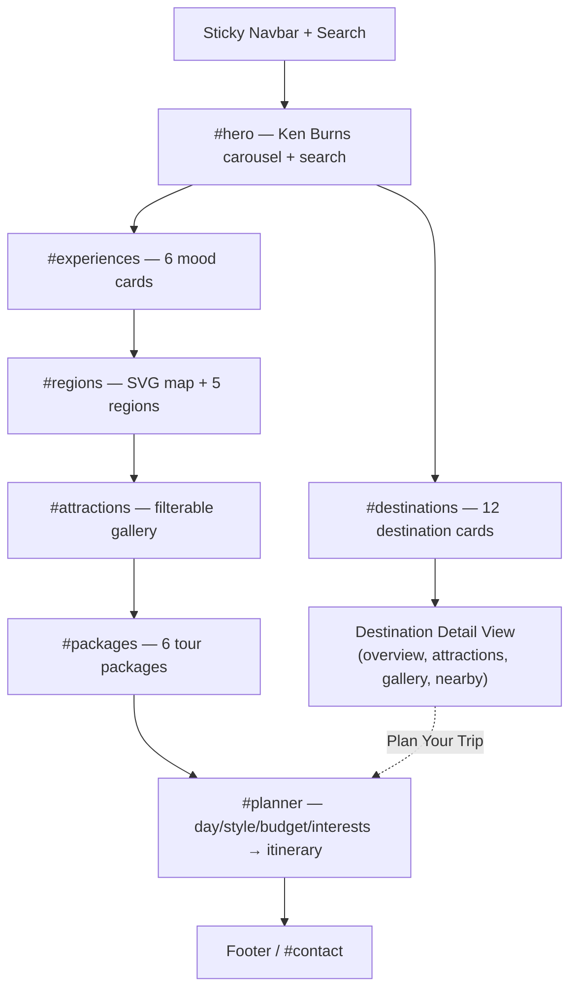
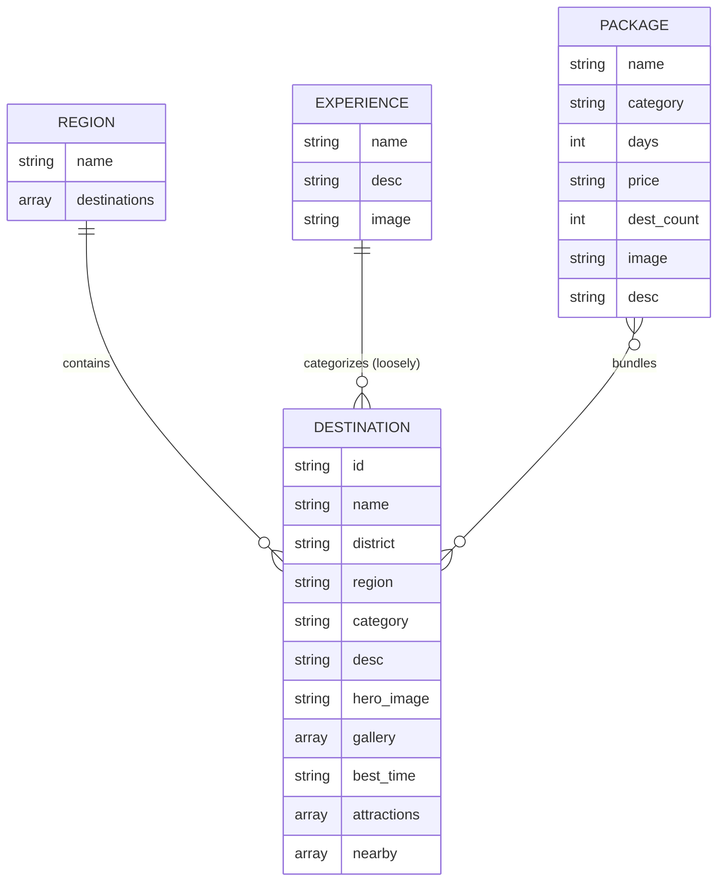
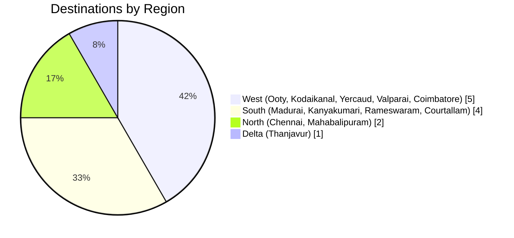
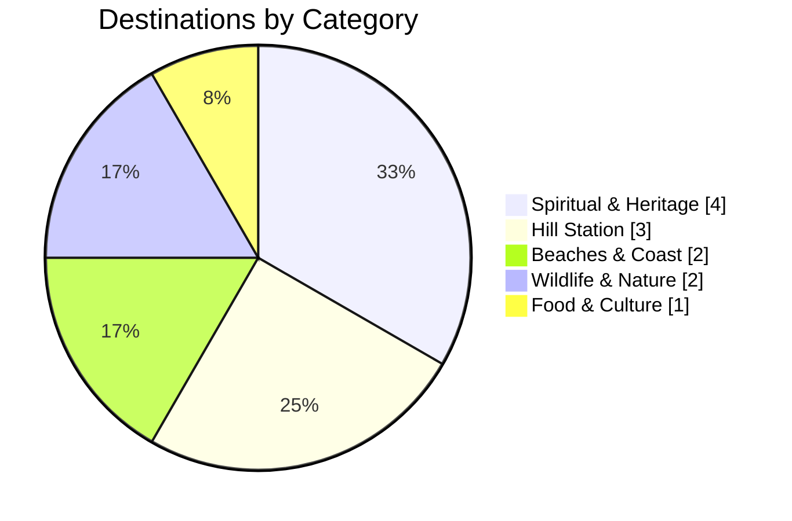
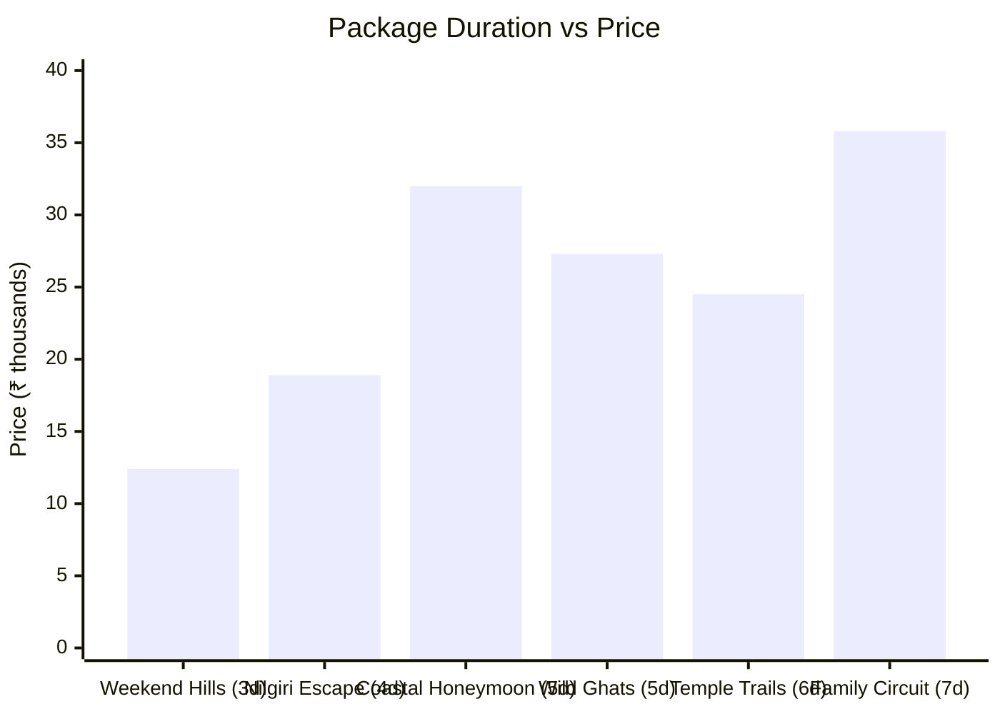
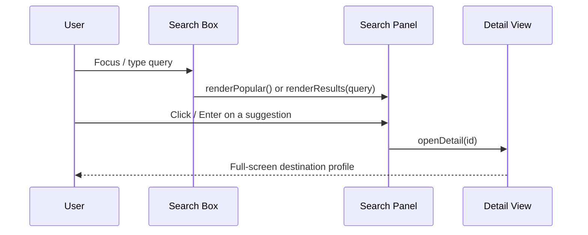
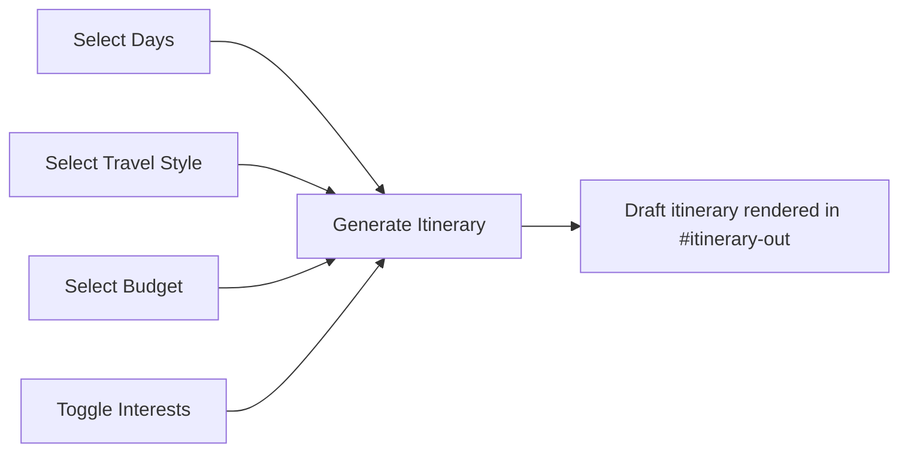
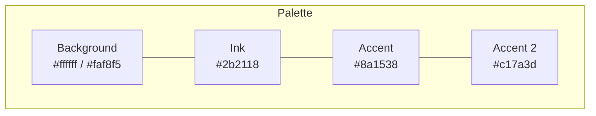

# Tamil Nadu Tourism — Single-Page Site

A single-file, animated tourism landing page for Tamil Nadu: temples, hill stations, beaches and wildlife, with search, an interactive region map, a filterable attractions gallery, tour packages and a simple trip planner. Built with plain HTML/CSS/JS — no framework, no build step.

**🔗 Live demo:** [betha-hemanth.github.io/Tamil-Nadu-Tourism](https://betha-hemanth.github.io/Tamil-Nadu-Tourism/)

`tamil-nadu-tourism.html` → open it in a browser and it runs.

---

## ✨ Features

| Area | What it does |
|---|---|
| **Hero** | Ken Burns background carousel (4 rotating photos), gradient headline, live destination search |
| **Search** | Type-ahead over all 12 destinations, "popular" suggestions when empty, keyboard nav (↑ ↓ ↵ Esc), friendly empty state |
| **Destinations rail** | Horizontal-scroll cards → opens a full **detail view** (overview, best time, attractions, nearby places, gallery) |
| **Experiences grid** | 6 travel "moods" (Spiritual, Hills, Beaches, Wildlife, Food & Culture, Adventure) |
| **Region explorer** | Clickable/hoverable SVG map of Tamil Nadu's 5 regions + tabs + place lists |
| **Attractions directory** | Filterable photo gallery (Temples, Beaches, Waterfalls, Hill Stations, Wildlife, Forts & Palaces) |
| **Packages rail** | 6 pre-built itineraries with days / price / destination count |
| **Trip planner** | Pick days, travel style, budget and interests → generates a draft itinerary client-side |
| **Polish** | Custom cursor particle trail, page-transition veil, scroll-reveal animations, rotating accent-color theme every 14s, mobile burger menu, floating action button |

All photography is pulled live from **Wikimedia Commons** via `Special:FilePath` — no local image assets required.

---

## 🗺️ Site Map



---

## 🧩 Data Model

Everything on the page is driven by five in-memory JS arrays/objects — there's no backend or database.



---

## 📊 Destination Breakdown

**By region** (5 regions defined; 4 currently populated with destinations)



**By category**



**Tour package length vs. price** (₹, 6 packages)



---

## 🔄 Key User Flows

**Search → Detail**


**Trip Planner**


---

## 🎨 Design System

- **Fonts:** Fraunces (serif, headings) + Manrope (sans, body)
- **Palette:** warm ivory background, deep maroon `#8a1538` → terracotta `#c17a3d` accent gradient — auto-rotates between 3 accent pairs every 14 seconds
- **Motion:** all animation respects `prefers-reduced-motion`
- **Radii:** 12 / 18 / 26px scale for small / medium / large surfaces



---

## 🛠️ Tech Stack

- Vanilla **HTML5 / CSS3 / JavaScript** (IIFE, no modules, no build tooling)
- **Google Fonts** (Fraunces, Manrope)
- **Wikimedia Commons** `Special:FilePath` for all imagery (dynamically sized via `?width=`)
- Native **SVG** for the region map and loader mark
- `IntersectionObserver` for scroll-reveal, `Canvas 2D` for the cursor particle trail

No dependencies to install — it's a single static file.

---

## 🚀 Running It

**Try it live:** https://betha-hemanth.github.io/Tamil-Nadu-Tourism/

```bash
# just open it
open tamil-nadu-tourism.html

# or serve it locally (recommended, avoids any file:// quirks)
python3 -m http.server 8000
# then visit http://localhost:8000/tamil-nadu-tourism.html
```

---

## ✏️ Customizing

| To change... | Edit... |
|---|---|
| Add/edit a destination | `destinations` array (search `const destinations = [`) |
| Add/edit a tour package | `packages` array |
| Add/edit an experience card | `experiences` array |
| Region → place mapping | `regions` object |
| Accent color themes | `themes` array (`applyTheme()`) |
| Hero carousel photos | `heroSeeds` array |
| Nav / footer links | corresponding `<nav>` / `<footer>` markup near the top of `<body>` |

---

## 📄 Credits

Destination photography courtesy of [Wikimedia Commons](https://commons.wikimedia.org/) contributors, fetched live via `Special:FilePath`.

This is a conceptual redesign / demo project — not an official Tamil Nadu Tourism property.
